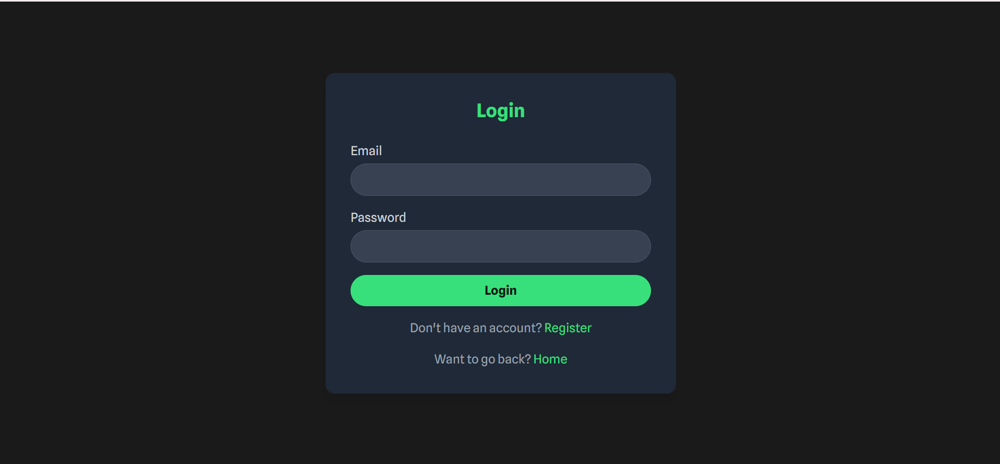
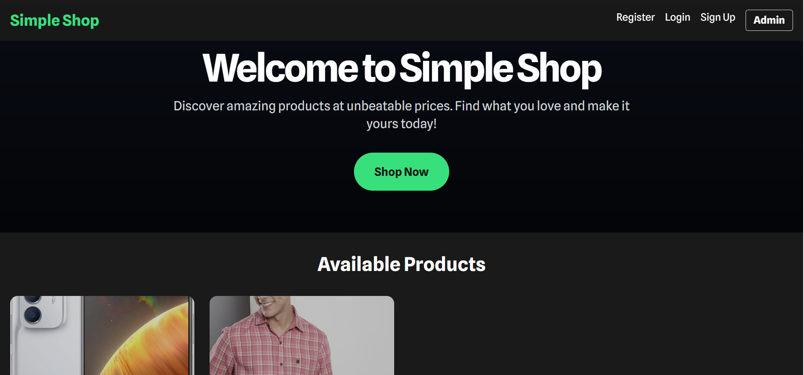
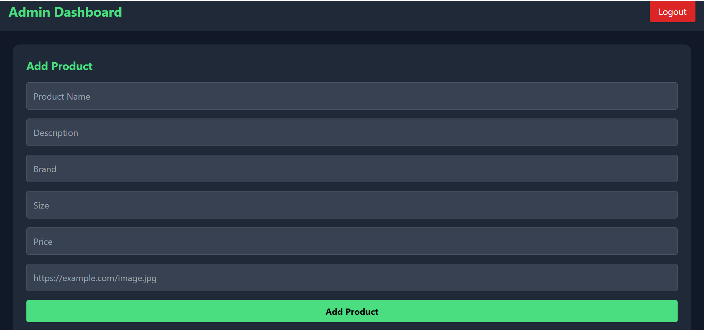

# Sample Screenshots of my simple-ecommerce-website

### Login Page



# Simple Shop - Spring Boot (Minimal E-Commerce App)

## 📖 Overview

Simple Shop is a lightweight e-commerce web application built with **Spring Boot**, **Thymeleaf**, and **MySQL**. It demonstrates basic functionalities like user registration, login, product listing, adding to cart, and checkout with orders.

This project is perfect for beginners who want to learn how to build web apps using Java and Spring Boot without dealing with advanced security or complex setups.

---

## 🛠 Tech Stack

- Java 17
- Spring Boot 3.1.4
- Thymeleaf
- MySQL
- Maven
- Bootstrap (optional for styling)
- Session-based authentication

---

## 📂 Project Features

✔ Index page showing products  
✔ User registration and login (session-based)  
✔ Admin can add products (images uploaded to `/uploads`)  
✔ Cart functionality with checkout  
✔ Orders stored in the database  

---

## 📥 Setup Instructions

### 1 Install Dependencies
- Java 17: [Download Java](https://www.oracle.com/java/technologies/javase/jdk17-archive-downloads.html)
- Maven: [Download Maven](https://maven.apache.org/download.cgi)
- MySQL: [Download MySQL](https://dev.mysql.com/downloads/mysql/)

### 2️ Create Database
Open MySQL and run:
```sql
CREATE DATABASE simple_shop;

3 Configure Application

Edit the file src/main/resources/application.properties and update your MySQL credentials:
spring.datasource.url=jdbc:mysql://localhost:3306/simple_shop
spring.datasource.username=YOUR_DB_USERNAME
spring.datasource.password=YOUR_DB_PASSWORD

4 Run the Application

Build and run the project using the following commands in the project directory:

mvn clean package
java -jar target/simple-shop-0.0.1-SNAPSHOT.jar


Visit http://localhost:8080 in your browser!


👤 Admin Setup

Register a new user at /register.

Manually update their role to ROLE_ADMIN in your MySQL database:

UPDATE users SET role = 'ROLE_ADMIN' WHERE username = 'your_username';


Access admin functionalities at /admin/add.

📸 Screenshots
🏠 Homepage

This is how the homepage looks after running the application. Users can browse products and access navigation menus.

🔑 Login Page

The login page allows registered users to sign in using their username and password.

➕ Add Product (Admin)

Admins can add new products by filling in the form and uploading images.

🚀 How to Use This Repository

Clone the repository:

git clone https://github.com/Ranjithagundappa2004/simple-shop-eccommerce-website.git

Follow the setup steps above to configure and run the project.

Open your browser and visit http://localhost:8080
 to start using the app.

📂 Project Structure
simple-shop-next/
├── .gitignore
├── README.md
├── pom.xml
├── src/
├── assets/
│   └── screenshots/
│       ├── homepage.png
│       ├── login.png
│       └── admin-add-product.png
├── uploads/   (excluded from Git tracking)
└── ...other files

🤝 Contributing

Feel free to fork this project, improve it, or report issues. Pull requests are welcome!

📄 License

This project is open-source and available under the MIT License.


